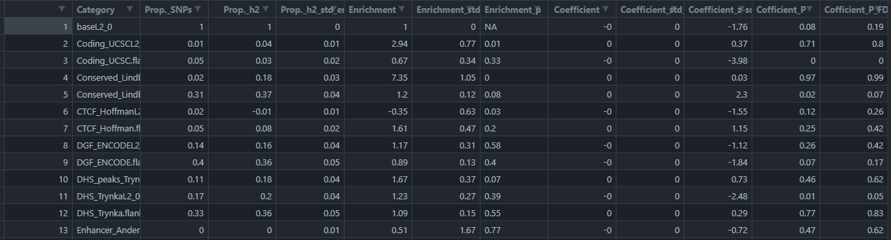

# Partitioned Heritability (h2) Result Processing

Processing of paritioned heritability result obtained by using LDSC tool.

Version:
- v1 : Calculate P-value of FDR. This P-value is added to the result as Coefficient_P_FDR.


Processed result file will be saved as `*_withFDR.csv`.

## Example
```
Rscript ./process_parh2.R --file ./example/parh2.example.results --dir ./example/
```

- Options
    - `--file <filename>` : Result file path of partitioned h2.
    - `--dir <directory>` : Directory path where the FDR calculated result file will be saved. If not specified, it will be saved in the same directory as where the Rscript is present.


- Output
    

